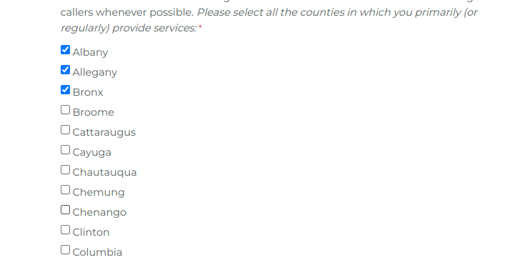
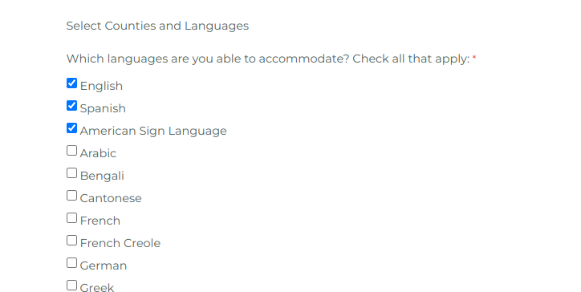
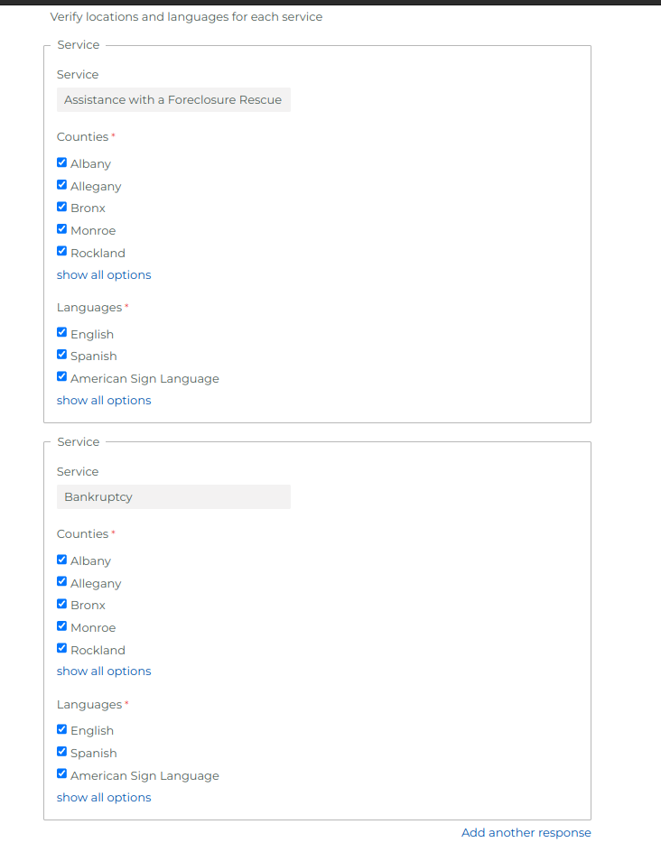

# Dynamic Form Assembly Script

## Description
A script for that creates custom sections based off of inputs from previous answers. 

Users select the primary fields that whose characteristics they will change later.

In the following questions, users will select options that will affect all selected primary fields

 

These sections are created below, allowing users to check and uncheck options without affecting all other sections

